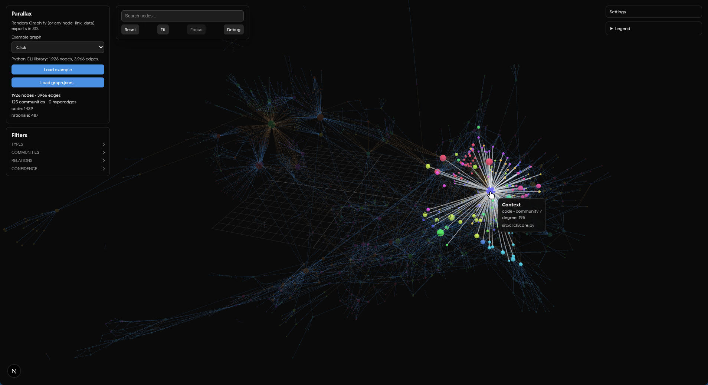

# Parallax

Parallax is a small local Next.js app for viewing semantic code graphs in 3D.
It reuses the 3D renderer from
[Omnigraph](https://github.com/Critlist/omnigraph), an earlier Tauri/Rust code
visualization project, and points it at
[Graphify](https://github.com/Graphify-Labs/graphify)-style `graph.json`
exports.

Graphify is the first supported input format. It is not part of this renderer:
Parallax does not parse repositories, call LLMs, build communities, or produce
graph exports. It adapts an existing graph export into a canonical graph model
and renders that model with Three.js through `3d-force-graph`.

If Graphify gives you a `graph.json`, Parallax gives you a local way to inspect
it in 3D: load the file, search for nodes, focus neighborhoods, filter semantic
metadata, and keep the data on your own machine.

## Screenshots




## Current Status

This is a shareable prototype, not a finished product. It exists because the
Omnigraph renderer was visually useful, and Graphify is now a better engine for
producing the semantic graph data that renderer needs.

The app can load the included sample or a local compatible JSON file in the
browser. There is no backend and no upload path; selected files stay local to
the browser session.

Parallax has been tested locally with Graphify exports ranging from roughly 800
nodes to 35,000+ nodes and 95,000+ edges.

Licensed under MIT. See `LICENSE`.

## Architecture

```text
Graphify export -> adapter -> canonical graph model -> Graph3DVisualization -> Three.js / 3d-force-graph
```

- Omnigraph supplied the original 3D renderer idea and interaction model.
- `src/lib/graphifyAdapter.ts` validates and maps Graphify/networkx
  `node_link_data` style exports into the renderer's `GraphData` shape.
- `src/lib/graph3d.ts` owns the 3D renderer boundary: force graph setup,
  Three.js node objects, camera movement, resize handling, and disposal.
- `src/components/GraphViewer.tsx` owns the UI shell: loading the bundled
  sample, reading a user-selected JSON file, showing stats, and showing the
  selected node.
- `src/app/page.tsx` dynamically loads the viewer because `3d-force-graph`
  touches `window` at import time and cannot be server-rendered.

## Requirements

- Bun 1.3.x
- Node.js 20.9 or newer, per the bundled Next.js 16 docs
- A modern WebGL-capable browser

The repository uses `bun.lock` as the lockfile and declares
`"packageManager": "bun@1.3.14"` in `package.json`.

## Setup

```bash
bun install
bun run dev
```

Open http://localhost:3000.

## Loading Graphs

Use **Example graph** and **Load example** to load a bundled sample.

| Example          | Source                                                  | License      | Nodes | Edges | Runtime path                              |
| ---------------- | ------------------------------------------------------- | ------------ | ----: | ----: | ----------------------------------------- |
| restoHack sample | Local fixture                                           | MIT          |   984 | 2,930 | `public/sample/graph.json`                |
| Commander.js     | [`tj/commander.js`](https://github.com/tj/commander.js) | MIT          |   831 | 1,166 | `public/examples/commander-js/graph.json` |
| Click            | [`pallets/click`](https://github.com/pallets/click)     | BSD-3-Clause | 1,926 | 3,966 | `public/examples/click/graph.json`        |

Use **Load graph.json...** to choose your own local JSON export. The expected
shape is Graphify's `graph.json` format, which is compatible with networkx
`node_link_data`: a top-level object with `nodes` and `links` arrays, node
`id` values, and link `source`/`target` values that refer to existing node ids.

Minimal compatible shape:

```json
{
  "nodes": [
    {
      "id": "src/app.ts",
      "name": "app.ts",
      "type": "code",
      "path": "src/app.ts"
    },
    {
      "id": "src/routes.ts",
      "name": "routes.ts",
      "type": "code",
      "path": "src/routes.ts"
    }
  ],
  "links": [
    {
      "source": "src/app.ts",
      "target": "src/routes.ts",
      "relation": "imports",
      "confidence": "EXTRACTED"
    }
  ]
}
```

Checked-in source fixtures live in `fixtures/graphify-restohack/`,
`fixtures/graphify-commander-js/`, and `fixtures/graphify-click/`. Runtime
copies under `public/` are what the examples dropdown fetches.

Larger generated Graphify exports have been validated locally for performance
testing, including Vite, FastAPI, Prometheus, and rust-analyzer scale graphs.
Those exports are not bundled because the generated JSON files are large; use
**Load graph.json...** for local test exports.

## Large Graphs

Parallax automatically switches very large graphs into an adaptive stress render
mode. In that mode it keeps the full graph loaded, but reduces ambient particles,
caps visible edges by semantic priority, lowers link opacity, and shortens force
simulation so large Graphify exports remain navigable. The debug overlay shows
the active render mode and current renderer counters.

## Commands

```bash
bun install
bun run format:check
bun run lint
bun run typecheck
bun run test
bun run build
```

Other useful commands:

```bash
bun run dev       # local development server
bun run start     # serve a production build after bun run build
bun run format    # rewrite files with Prettier
bun run test:watch
```

## Project Layout

```text
src/app/                 Next.js App Router entry points
src/components/          React UI for the graph viewer
src/lib/graphifyAdapter.ts
src/lib/graph3d.ts
fixtures/graphify-restohack/
fixtures/graphify-commander-js/
fixtures/graphify-click/
public/sample/graph.json
public/examples/
```

## Limitations

- Graphify is the first supported input format; other graph shapes need an
  adapter before they should be considered supported.
- Hyperedges are counted in stats but not rendered as first-class visual
  objects.
- Link confidence is carried through the canonical model but only the
  confidence label currently affects link color.
- Node selection is passed from the renderer to React through an explicit
  callback, keeping selection state local to the viewer component.
- CI runs formatting, linting, typechecking, tests, and a production build on
  GitHub Actions.

## Planned

- Community-level LOD.
- Expand-on-demand navigation.
- Additional semantic graph adapters.
- Larger graph optimizations.
